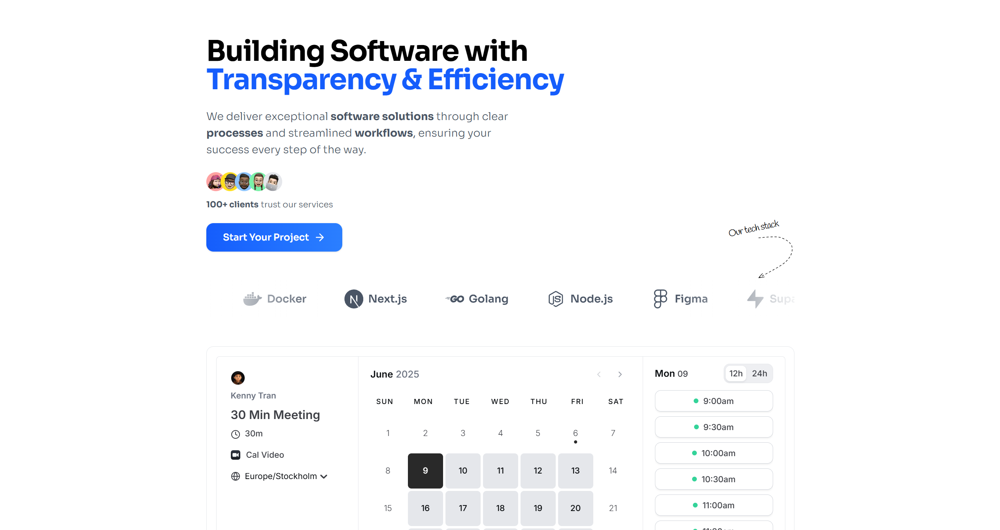

# Ketryon

Ketryon is a technology company building transparent and efficient software solutions. We specialize in open-source web development and design to deliver exceptional digital experiences for our clients.

This repository contains the full source code for our company website, [ketryon.com](https://ketryon.com), built with Next.js, TypeScript, and Tailwind CSS.

  

---

## ✨ Features

- **Transparent Process:** Our development process is open and collaborative, ensuring clients are always in the loop.
- **Modern Tech Stack:** Built with the latest web technologies for performance, scalability, and maintainability.
- **Open Source by Default:** We believe in the power of open source to build trust and foster innovation.
- **Client-Centric Design:** We craft beautiful and intuitive user experiences tailored to your brand and audience.

---

## 🖼️ Screenshot



---

## 🛠️ Tech Stack

- **Framework:** [Next.js](https://nextjs.org) (App Router)
- **Language:** [TypeScript](https://www.typescriptlang.org)
- **Styling:** [Tailwind CSS](https://tailwindcss.com)
- **Icons:** [Lucide React](https://lucide.dev)
- **Animations:** [Framer Motion](https://www.framer.com/motion/)
- **Scheduling:** [Cal.com](https://cal.com)
- **Deployment:** [Vercel](https://vercel.com)

---

## 🚀 Getting Started

To get a local copy up and running, follow these simple steps.

### Prerequisites

- Node.js (v18 or later)
- pnpm

### Installation

1. **Clone the repo:**
   ```sh
   git clone https://github.com/iamk3nnyt/ketryon.com.git
   cd ketryon.com
   ```
2. **Install dependencies:**
   ```sh
   pnpm install
   ```
3. **Set up environment variables:**
   - Create a `.env.local` file from `.env.example` and fill in the required values.
4. **Run the dev server:**
   ```sh
   pnpm dev
   ```
5. **Open [http://localhost:3000](http://localhost:3000) in your browser.**

---

## 🤝 Contributing

Contributions, issues, and feature requests are welcome! Feel free to check the [issues page](https://github.com/iamk3nnyt/ketryon.com/issues).

Please read the [Contributing Guide](./CONTRIBUTING.md) and [Code of Conduct](./CODE_OF_CONDUCT.md) before participating.

---

## 📄 License

This project is licensed under the MIT License - see the [LICENSE](./LICENSE) file for details.
